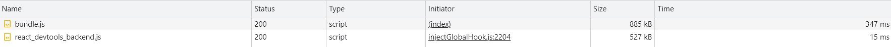
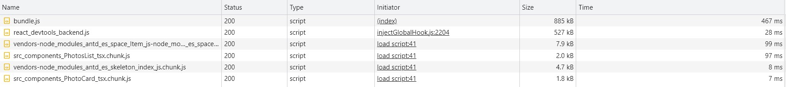

# JavaScript design patterns

In this code some of the JavaScript Design patterns are demonestrated.
This is a registration form with three steps:
- User information
- Category Selections
- Sub category selection

**Note:** This project is a demo and is not intended to have all features functioning

## 1- Optimize your loading sequence pattern
Here we did code splitting uses `React.lazy` and `Suspense` tool/library, which helps you to load a dependency lazily and only load it when needed by the user.

- `PhotosList.tsx` and `PhotoCard.tsx` are both loaded using `React.lazy`
- `PhotoCard.tsx` is loaded inside `PhotosList.tsx`
- `PhotosList.tsx` is loaded in steps 2 and 3

### Fetched packages when the page loads

### Fetched packages after navigating to step 2 (`PhotosList.tsx` and `PhotoCard.tsx` are fetched)

## Tools Used

* [Ant Design](https://ant.design/) css framework was used for styling purposes
* [Tailwind css](https://tailwindcss.com/) css utility framework was used for styling purposes

In the project directory, you can run:

### `npm start`

Runs the app in the development mode.\
Open [http://localhost:3000](http://localhost:3000) to view it in the browser.

The page will reload if you make edits.\
You will also see any lint errors in the console.

### `npm run build`

Builds the app for production to the `build` folder.\
It correctly bundles React in production mode and optimizes the build for the best performance.

The build is minified and the filenames include the hashes.\
Your app is ready to be deployed!

See the section about [deployment](https://facebook.github.io/create-react-app/docs/deployment) for more information.